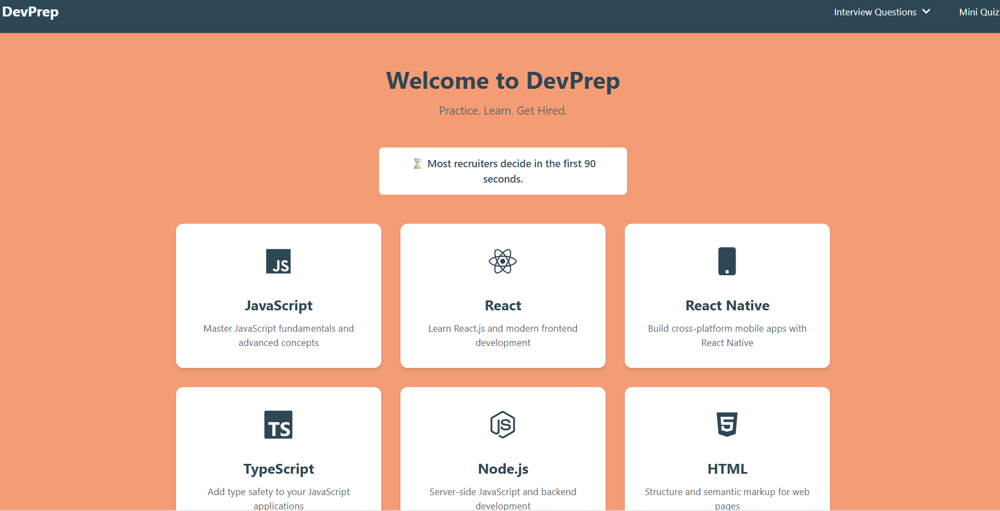

# DevPrep 🚀

A comprehensive web development interview preparation platform



## 📝 Project Description

DevPrep is a modern, mobile-responsive web application designed to help web developers prepare for technical interviews. Whether you're a junior developer taking your first steps or a senior developer preparing for a lead role, DevPrep provides a structured and interactive way to enhance your technical knowledge and interview readiness.

### Why DevPrep?

- **Comprehensive Coverage**: Access interview questions across various web development topics
- **Role-Based Learning**: Filter questions by experience level (Junior to Lead)
- **Interactive Learning**: Test your knowledge with real-time quizzes and scoring
- **Mobile-First Design**: Practice anywhere, anytime with our responsive interface
- **Regular Updates**: Stay current with the latest web development trends and interview patterns

## 🎯 Target Audience

- Junior Web Developers
- Mid-Level Developers
- Senior Developers
- Tech Leads
- Anyone preparing for web development interviews

## 🔗 Live Demo

[View Live Demo](https://yourusername.github.io/devprep)

## ✨ Features

- **Categorized Questions**

  - JavaScript
  - React
  - HTML/CSS
  - Node.js
  - And more...
- **Experience Level Filters**

  - Junior Level
  - Mid-Level
  - Senior Level
  - Lead Level
- **Interactive Quiz System**

  - Real-time scoring
  - Immediate feedback
  - Progress tracking
  - Topic-specific quizzes
- **User Experience**

  - Animated "Did You Know?" information box
  - Mobile-first responsive design
  - Clean and intuitive interface
  - Dark/Light mode support

## 🛠️ Tech Stack

- **Frontend Framework**: React
- **Styling**: CSS3 with modern features
- **Routing**: React Router
- **Data Management**: JSON
- **Icons**: React Icons
- **Deployment**: GitHub Pages

## 📁 Project Structure

```
devprep/
├── src/
│   ├── components/     # Reusable UI components
│   │   └── quiz/      # Topic-specific quiz data
│   ├── pages/         # Main application pages
│   └── styles/        # Global styles and themes
├── public/            # Static assets
└── package.json       # Project dependencies
```

## 🚀 Getting Started

### Prerequisites

- Node.js (v14.0.0 or higher)
- npm (v6.0.0 or higher)
- Git

### Installation

1. Clone the repository

   ```bash
   git clone https://github.com/yourusername/devprep.git
   ```
2. Navigate to project directory

   ```bash
   cd devprep
   ```
3. Install dependencies

   ```bash
   npm install
   ```
4. Start the development server

   ```bash
   npm start
   ```
5. Open [http://localhost:3000](http://localhost:3000) in your browser

## 📦 Deployment

### GitHub Pages Deployment

1. Add homepage to `package.json`:

   ```json
   "homepage": "https://arzucaner.github.io/devprep"
   ```
2. Install GitHub Pages package:

   ```bash
   npm install --save gh-pages
   ```
3. Add deployment scripts to `package.json`:

   ```json
   "scripts": {
     "predeploy": "npm run build",
     "deploy": "gh-pages -d build"
   }
   ```
4. Deploy to GitHub Pages:

   ```bash
   npm run deploy
   ```

## 📄 License

This project is licensed under the MIT License - see the [LICENSE](LICENSE) file for details.

## 🙏 Acknowledgements

- Inspired by real-world interview preparation needs
- Icons provided by React Icons
- Built with React App

## 🤝 Contributing

Contributions, issues, and feature requests are welcome! 

1. Fork the Project
2. Create your Feature Branch
3. Commit your Changes
4. Push to the Branch
5. Open a Pull Request

---
